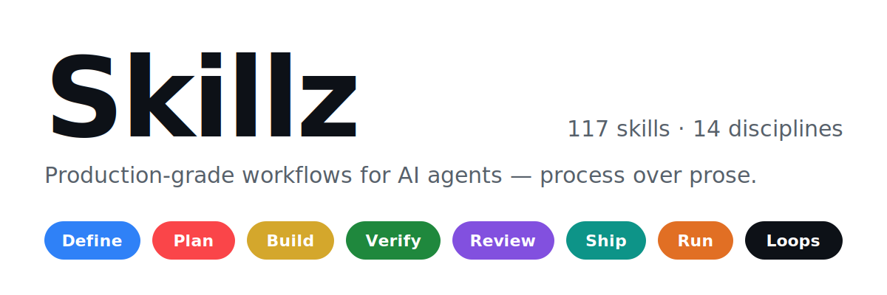

# Skillz

Production-grade skills for AI agents — across the whole software lifecycle and the disciplines around it.

Skills encode the workflows, quality gates, and best practices that senior practitioners use — engineers, SREs, analysts, PMs, designers, researchers. These are packaged so AI agents follow them consistently: process over prose, workflows over reference, steps with exit criteria over essays without them.

<p align="center">
  
</p>

```
  DEFINE           PLAN            BUILD           VERIFY          REVIEW           SHIP            RUN
 ┌────────┐     ┌────────┐     ┌────────┐     ┌────────┐     ┌────────┐     ┌────────┐     ┌────────┐
 │  PRD   │ ──▶ │ Slice  │ ──▶ │  Code  │ ──▶ │  Test  │ ──▶ │ Review │ ──▶ │ Deploy │ ──▶ │Operate │
 │Research│     │  Rank  │     │ Design │     │ Debug  │     │ Secure │     │Rollback│     │On-call │
 └────────┘     └────────┘     └────────┘     └────────┘     └────────┘     └────────┘     └────────┘
 product-pm      product-pm     software-eng    testing-qa      security       devops-cicd     sre-incident-
 research                       design-ux       dsa-algos       writing-docs                   response
```

…plus four categories beyond the lifecycle: **data-analytics**, **finance-ops**, **career-productivity**, and **loop-engineering** — this repo's distinctive category: skills for designing and debugging the iterative loops agentic systems themselves run inside.

## Entry Points

Nine skills that map to the lifecycle. Each one's Related-skills section chains into the rest of its phase.

| What you're doing | Start with | Key principle |
|---|---|---|
| Define what to build | [prd-writing](skills/product-pm/prd-writing/SKILL.md) | Problem before solution |
| Plan how to build it | [user-story-slicing](skills/product-pm/user-story-slicing/SKILL.md) | Thin vertical slices |
| Design the surface | [api-design-rest](skills/software-engineering/api-design-rest/SKILL.md) | Spec before handler |
| Prove it works | [unit-test-design](skills/testing-qa/unit-test-design/SKILL.md) | Tests are proof, red-checked |
| Review before merge | [code-review-checklist](skills/software-engineering/code-review-checklist/SKILL.md) | Correctness first, style last |
| Secure it | [secure-code-review](skills/security/secure-code-review/SKILL.md) | Fix the class, not the instance |
| Ship to production | [deployment-rollback-plan](skills/devops-cicd/deployment-rollback-plan/SKILL.md) | Every deploy undoable |
| Run it | [incident-triage](skills/sre-incident-response/incident-triage/SKILL.md) | Mitigate before diagnosing |
| Keep the agent honest | [using-these-skills](skills/using-these-skills/SKILL.md) | Never skip Verification |

Skills also activate automatically based on what you're doing — a flaky test triggers `flaky-test-diagnosis`, a leaked credential triggers `secrets-incident-response`, an A/B readout triggers `ab-test-analysis`, and so on. Each skill's frontmatter `description` carries positive triggers AND explicit "NOT for" exclusions, so the right skill loads and the almost-right one doesn't.

## Quick Start

- **[Claude Code](docs/install-claude-code.md)** (recommended)
- **[Cursor](docs/install-cursor.md)**
- **[Gemini CLI](docs/install-gemini-cli.md)**
- **[Windsurf](docs/install-windsurf.md)**
- **[OpenCode](docs/install-opencode.md)**

The 30-second version for Claude Code:

```bash
git clone https://github.com/Nandansai08/skillz.git
find skillz/skills -mindepth 2 -maxdepth 2 -type d -exec cp -r {} ~/.claude/skills/ \;
cp -r skillz/skills/using-these-skills ~/.claude/skills/
```

⚠️ **The common snag:** Claude Code discovers skills at `.claude/skills/<skill-name>/SKILL.md`, but this repo nests them under categories. Copying a *category* folder puts SKILL.md one level too deep and it won't be discovered — copy skill folders themselves, or use the `find` one-liner above. Details in [docs/install-claude-code.md](docs/install-claude-code.md).

## All 117 Skills

117 skills total — 116 practitioner skills plus the `using-these-skills` meta-skill. Each is a structured workflow with steps, verification gates, and anti-rationalization tables. Reference any skill directly, or load the meta-skill and let the router dispatch.

### Meta — Discover which skill applies

| Skill | What It Does | Use When |
|---|---|---|
| [using-these-skills](skills/using-these-skills/SKILL.md) | Maps incoming work to the right skill across all 14 categories; defines shared operating rules (surface assumptions, ask don't guess, never skip Verification) | Starting a session or deciding which skill applies |

### Software Engineering — Write and change code

| Skill | What It Does | Use When |
|---|---|---|
| [code-review-checklist](skills/software-engineering/code-review-checklist/SKILL.md) | Severity-ordered review pass: correctness, security, performance, style — in that order | Reviewing any PR or diff |
| [refactor-safely](skills/software-engineering/refactor-safely/SKILL.md) | Behavior-preserving restructuring in test-gated, individually-committed mechanical steps | Restructuring working code |
| [debugging-by-bisection](skills/software-engineering/debugging-by-bisection/SKILL.md) | Halve the search space — commits, inputs, config — with a scripted check | "It worked last week" and the cause is unknown |
| [legacy-code-first-contact](skills/software-engineering/legacy-code-first-contact/SKILL.md) | Characterization tests freeze current behavior before you touch anything | Changing unfamiliar, untested code |
| [api-design-rest](skills/software-engineering/api-design-rest/SKILL.md) | Resource naming, status codes, pagination, idempotency, versioning — spec before handler | Designing or reviewing an HTTP API |
| [error-handling-strategy](skills/software-engineering/error-handling-strategy/SKILL.md) | Classify failures into bins, catch only at boundaries, make fallbacks loud and bounded | Writing failure paths; auditing swallowed errors |
| [dependency-upgrade](skills/software-engineering/dependency-upgrade/SKILL.md) | Changelog-first, one-per-PR, deprecation-bridged, staged, trivially revertible | Upgrading libraries, frameworks, runtimes |
| [code-comments-that-last](skills/software-engineering/code-comments-that-last/SKILL.md) | Comment whys and constraints, never narration; delete rot; TODO hygiene | Writing or reviewing comments and docstrings |
| [monorepo-navigation](skills/software-engineering/monorepo-navigation/SKILL.md) | Definition-shaped search, build-graph blast radius, git archaeology for owners | Finding code/owners/impact in a big repo |

### Testing & QA — Prove it works

| Skill | What It Does | Use When |
|---|---|---|
| [unit-test-design](skills/testing-qa/unit-test-design/SKILL.md) | One behavior per test, outcomes over implementation, red-checked, builder-driven arrange | Writing or reviewing unit tests |
| [test-doubles-choice](skills/testing-qa/test-doubles-choice/SKILL.md) | Stub/fake/spy/mock chosen by what's verified; adapters over vendor-SDK mocking; contract-tested fakes | A dependency needs replacing in tests |
| [edge-case-enumeration](skills/testing-qa/edge-case-enumeration/SKILL.md) | Per-type checklists: boundaries±1, empties, Unicode, time, concurrency — then rank and cut | "What edge cases am I missing?" |
| [flaky-test-diagnosis](skills/testing-qa/flaky-test-diagnosis/SKILL.md) | Reproduce the rate, route by fails-alone/in-suite/in-CI, fix the polluter not the victim | A test passes sometimes and fails sometimes |
| [integration-test-strategy](skills/testing-qa/integration-test-strategy/SKILL.md) | Test the seams with real engines (testcontainers), one lie per test, contract tests across services | Deciding what to test with real components |
| [property-based-testing](skills/testing-qa/property-based-testing/SKILL.md) | Properties from the five-pattern catalog, generators that reach boundaries, pinned counterexamples | Large input spaces with statable invariants |
| [regression-test-from-bug](skills/testing-qa/regression-test-from-bug/SKILL.md) | Failing test first, at the lowest exhibiting layer, then the fix, then the sibling sweep | Fixing any reported bug |
| [coverage-analysis](skills/testing-qa/coverage-analysis/SKILL.md) | Branch mode, risk-ranked gaps, mutation spot-checks, diff-based gates | Reading a coverage report honestly |
| [e2e-test-triage](skills/testing-qa/e2e-test-triage/SKILL.md) | Classify journey-critical vs logic-in-disguise vs inertia; stabilize keepers; demote with receivers | The browser suite is slow, flaky, bloated |

### DevOps & CI/CD — Ship with confidence

| Skill | What It Does | Use When |
|---|---|---|
| [ci-pipeline-design](skills/devops-cicd/ci-pipeline-design/SKILL.md) | Fail-fast ordering, keyed caching, measured shards, trigger routing — under a 10-minute budget | CI is slow or being designed |
| [dockerfile-optimization](skills/devops-cicd/dockerfile-optimization/SKILL.md) | Layer ordering by change frequency, multi-stage builds, cache mounts, non-root + scan floor | Slow builds or bloated images |
| [github-actions-authoring](skills/devops-cicd/github-actions-authoring/SKILL.md) | Precise triggers, minimum permissions, SHA-pinned actions, injection-safe expressions | Writing or debugging workflows |
| [deployment-rollback-plan](skills/devops-cicd/deployment-rollback-plan/SKILL.md) | Expand/contract migrations, N/N-1 compatibility, kill switches, pre-written tested rollbacks | Any deploy touching schema or state |
| [secrets-management](skills/devops-cicd/secrets-management/SKILL.md) | Identity over secrets, tiered storage, routine rotation, mechanical commit-blocking | Handling credentials anywhere |
| [infra-as-code-review](skills/devops-cicd/infra-as-code-review/SKILL.md) | Read the plan not the diff; trace every replace to its forcing attribute; drift decisions explicit | Reviewing Terraform/CloudFormation changes |
| [environment-parity](skills/devops-cicd/environment-parity/SKILL.md) | One artifact promoted everywhere; divergences classified; parity verified mechanically | "Works in staging but not prod" |
| [release-versioning](skills/devops-cicd/release-versioning/SKILL.md) | Bump by consumer impact, automated from commit metadata, immutable CI-created tags | Versioning, tagging, changelog mechanics |

### SRE & Incident Response — Run it in production

| Skill | What It Does | Use When |
|---|---|---|
| [incident-triage](skills/sre-incident-response/incident-triage/SKILL.md) | First 15 minutes: impact in user terms, declare high, split IC/ops roles, mitigate before diagnosing | Production is down — start HERE |
| [production-debugging](skills/sre-incident-response/production-debugging/SKILL.md) | Anchor on what changed, characterize the failure's shape, metrics→logs→traces on one exemplar | Live symptoms, no local repro |
| [blameless-postmortem](skills/sre-incident-response/blameless-postmortem/SKILL.md) | Artifact-built timelines, contributing factors over root cause, action items that survive backlogs | After any SEV1/SEV2 or near-miss |
| [alerting-design](skills/sre-incident-response/alerting-design/SKILL.md) | Symptom-based paging on burn rates, three routing lanes, monthly actionability review | Pager noise, or detection gaps |
| [slo-definition](skills/sre-incident-response/slo-definition/SKILL.md) | Journey SLIs measured at the user's side, targets from baselines, budgets with pre-agreed policy | Setting reliability targets |
| [runbook-authoring](skills/sre-incident-response/runbook-authoring/SKILL.md) | Verify→Mitigate→Diagnose→Escalate docs a 3am responder from another team can execute | An alert has no runbook |
| [capacity-planning](skills/sre-incident-response/capacity-planning/SKILL.md) | Find the chain's real constraint, load-test to the knee, headroom by reaction time, trigger-based plans | Traffic events or growth walls ahead |
| [on-call-handoff](skills/sre-incident-response/on-call-handoff/SKILL.md) | Fixed-template notes, explicit transfer/park states, access checks, trend reading across weeks | Rotation changes |

### Security — Make attacks expensive

| Skill | What It Does | Use When |
|---|---|---|
| [threat-modeling](skills/security/threat-modeling/SKILL.md) | STRIDE walk over trust boundaries, threats as attack sentences, ranked with dispositions | Design-time "what could go wrong" |
| [secure-code-review](skills/security/secure-code-review/SKILL.md) | Class-by-class hunting with grep patterns — authz first, injection second, siblings swept | Code-level vulnerability review |
| [dependency-vulnerability-audit](skills/security/dependency-vulnerability-audit/SKILL.md) | Reachability × exposure × exploit maturity, not CVSS headlines; fixes verified on deployed artifacts | Scanner findings or a headline CVE |
| [authn-authz-design](skills/security/authn-authz-design/SKILL.md) | Rent authn, boring sessions by default, one authz choke point, tenancy below the app layer | Designing auth for anything |
| [input-validation-boundaries](skills/security/input-validation-boundaries/SKILL.md) | Parse-don't-validate at boundaries, allowlists by shape, canonicalize-then-check, reject don't repair | Untrusted input crosses a boundary |
| [secrets-incident-response](skills/security/secrets-incident-response/SKILL.md) | Rotate first, audit usage across the window, then purge — with the sibling scan before closing | A credential leaked — NOW |
| [security-headers-config](skills/security/security-headers-config/SKILL.md) | The floor today, HSTS ramped, CSP report-only-first, CORS as an allowlist never a reflex | Hardening web response headers |
| [least-privilege-review](skills/security/least-privilege-review/SKILL.md) | Granted-vs-used diffs, the four classic over-grants, escalation graphs, shrink with a safety net | IAM/permissions audits |

### Data & Analytics — Numbers that survive scrutiny

| Skill | What It Does | Use When |
|---|---|---|
| [exploratory-data-analysis](skills/data-analytics/exploratory-data-analysis/SKILL.md) | Grain first, then columns, distributions, time gaps, outliers — ending in written findings | First contact with any dataset |
| [sql-query-optimization](skills/data-analytics/sql-query-optimization/SKILL.md) | EXPLAIN ANALYZE with actuals, composite indexes, sargability, keyset pagination | A query is slow |
| [data-cleaning-pipeline](skills/data-analytics/data-cleaning-pipeline/SKILL.md) | Scripted staged cleaning: reject lanes, mapping tables, survivor rules, row-exact reconciliation | Messy data needs to become trustworthy |
| [metric-definition](skills/data-analytics/metric-definition/SKILL.md) | Every noun pinned, denominators interrogated, edge cases legislated, guardrails paired | Defining a metric people will act on |
| [ab-test-analysis](skills/data-analytics/ab-test-analysis/SKILL.md) | Pre-registration, no peeking, SRM first, effects with intervals, segments as hypotheses only | Designing or reading an A/B test |
| [medallion-architecture-design](skills/data-analytics/medallion-architecture-design/SKILL.md) | Bronze preserves, silver conforms, gold serves — with blocking gates and drilled rebuilds | Structuring lakehouse/warehouse layers |
| [spark-etl-debugging](skills/data-analytics/spark-etl-debugging/SKILL.md) | Task-distribution triage: skew vs shuffle vs OOM vs retries — most OOM is skew in costume | Spark jobs failing or crawling |
| [data-pipeline-idempotency](skills/data-analytics/data-pipeline-idempotency/SKILL.md) | Overwrite-partition or keyed merge, logical dates, transactional watermarks, the double-run test | Any pipeline that will ever re-run (all of them) |
| [cohort-retention-analysis](skills/data-analytics/cohort-retention-analysis/SKILL.md) | Same-age columns only, blank-not-zero triangles, composition confounds, stripes read correctly | "Is retention improving?" |

### DSA & Algorithms — The pattern families

| Skill | What It Does | Use When |
|---|---|---|
| [complexity-analysis](skills/dsa-algorithms/complexity-analysis/SKILL.md) | Name the variables, count through structure, expand hidden costs, check against the budget table | "Will this survive 100× the input?" |
| [data-structure-selection](skills/dsa-algorithms/data-structure-selection/SKILL.md) | The op-mix decides: the decision table plus the real-world corrections textbooks omit | Choosing a container |
| [two-pointer-sliding-window](skills/dsa-algorithms/two-pointer-sliding-window/SKILL.md) | Three shapes, one window template, and the monotonicity test that gates the whole pattern | Subarray/substring/pair problems |
| [graph-traversal-patterns](skills/dsa-algorithms/graph-traversal-patterns/SKILL.md) | See the graph, choose by question (BFS/DFS/Kahn's/union-find), templates with invariants | Reachability, ordering, groups, "min moves" |
| [dynamic-programming-derivation](skills/dsa-algorithms/dynamic-programming-derivation/SKILL.md) | State sentences, last-decision recurrences, memo-then-tabulate, brute-force oracles | Counting/optimizing over choices |
| [binary-search-variants](skills/dsa-algorithms/binary-search-variants/SKILL.md) | One first_true template for every boundary; search-on-answer for optimization | Boundaries, "smallest X such that" |
| [heap-and-priority-patterns](skills/dsa-algorithms/heap-and-priority-patterns/SKILL.md) | Size-k inversion, k-way merge, two-heap medians, lazy tombstones | Top-k, priority scheduling, running stats |
| [string-algorithm-toolkit](skills/dsa-algorithms/string-algorithm-toolkit/SKILL.md) | Stdlib baseline first; Aho-Corasick/hashing/tries justified by sizes written down | String matching outgrowing brute force |

### Writing & Docs — Documents that get read

| Skill | What It Does | Use When |
|---|---|---|
| [readme-authoring](skills/writing-docs/readme-authoring/SKILL.md) | First-screen what/why/quickstart, tested examples with output, the fresh-clone test | Writing or fixing a README |
| [api-documentation](skills/writing-docs/api-documentation/SKILL.md) | Time-to-first-call walkthroughs, realistic executed examples, error catalogs, drift alarms | Documenting an API for consumers |
| [architecture-decision-record](skills/writing-docs/architecture-decision-record/SKILL.md) | Unfoldable context, fair options, both-direction consequences, ranked drivers, supersede never edit | Recording a significant decision |
| [technical-blog-post](skills/writing-docs/technical-blog-post/SKILL.md) | Disputable takeaway first, honest dead ends, evidence with axes, one named reader | Turning work into an article |
| [changelog-writing](skills/writing-docs/changelog-writing/SKILL.md) | Reader-impact entries, loud breaking changes with migrations, curated not dumped | Preparing a release's changelog |
| [onboarding-doc-design](skills/writing-docs/onboarding-doc-design/SKILL.md) | Timeline-structured day-1/week-1/month-1 with the new-hire audit flywheel | New people keep getting stuck |
| [docs-information-architecture](skills/writing-docs/docs-information-architecture/SKILL.md) | Diátaxis quadrants, journey-priority filling, goal-based navigation, ruthless deletion | Users can't find anything in the docs |
| [release-notes](skills/writing-docs/release-notes/SKILL.md) | 1–3 highlights framed as reader outcomes, action-required unmissable, the support check | Announcing a release to its audience |
| [natural-prose-editing](skills/writing-docs/natural-prose-editing/SKILL.md) | Strip stock phrases, break triads, vary rhythm, concrete over vague — writing quality, never disguise | Text reads stiff, generic, "AI-sounding" |

### Product & PM — Build the right thing

| Skill | What It Does | Use When |
|---|---|---|
| [prd-writing](skills/product-pm/prd-writing/SKILL.md) | Evidence-backed problems, explicit non-goals, falsifiable success, living open questions | Speccing a feature multiple people will build |
| [user-story-slicing](skills/product-pm/user-story-slicing/SKILL.md) | Vertical slices via the split catalog, INVEST weaponized, walking skeleton first | Breaking an epic into shippable pieces |
| [prioritization-frameworks](skills/product-pm/prioritization-frameworks/SKILL.md) | RICE/ICE/Kano by decision type; scores structure argument, humans decide; force-ranked output | Ranking a contested backlog |
| [roadmap-communication](skills/product-pm/roadmap-communication/SKILL.md) | Now/Next/Later with honest certainty gradients, problems over dates, tracked promise liabilities | Sharing the roadmap outward |
| [stakeholder-update](skills/product-pm/stakeholder-update/SKILL.md) | Status-vs-goal first line, Progress/Risks/Asks on one screen, bad news at likely not certain | Recurring status to people outside the work |
| [feature-scoping-cut](skills/product-pm/feature-scoping-cut/SKILL.md) | Protect the kernel, cut along standard axes never quality, disposition every cut | It won't fit the timeline |
| [user-interview-synthesis](skills/product-pm/user-interview-synthesis/SKILL.md) | Said-vs-means layers, behavior over opinion, bottom-up themes, graded findings | Interview notes must become findings |
| [competitive-analysis](skills/product-pm/competitive-analysis/SKILL.md) | Jobs-based framing, hands-on teardowns, pricing as strategy, compete/counter/concede/ignore calls | A competitor moved, or roadmap needs the landscape |

### Design & UX — Interfaces that respect users

| Skill | What It Does | Use When |
|---|---|---|
| [ui-heuristic-review](skills/design-ux/ui-heuristic-review/SKILL.md) | Task-first Nielsen pass, severity-rated principle-anchored findings, taste filtered out | Evaluating a UI without user testing |
| [accessibility-audit](skills/design-ux/accessibility-audit/SKILL.md) | Beyond the scanner: keyboard walks, screen-reader passes, focus management, component-level fixes | A11y check before release or after complaints |
| [design-system-tokens](skills/design-ux/design-system-tokens/SKILL.md) | Primitive/semantic layers, constrained scales, theming as re-binding, the lint ratchet | Token setup, dark mode, 45 grays |
| [form-design](skills/design-ux/form-design/SKILL.md) | Delete fields first, blur-then-validate, input-layer wins, per-field instrumentation | Building or fixing forms |
| [empty-loading-error-states](skills/design-ux/empty-loading-error-states/SKILL.md) | The five-state matrix per data source, empties by cause, errors with exits, forced-state testing | Any screen backed by dynamic data |
| [responsive-layout-strategy](skills/design-ux/responsive-layout-strategy/SKILL.md) | Intrinsic CSS first, content-driven breakpoints, container queries, awkward-width testing | Adapting a UI across screen sizes |
| [microcopy-writing](skills/design-ux/microcopy-writing/SKILL.md) | Buttons that say what they do, two-part errors, undo over confirms, term sheets | The words inside a UI |
| [wireframe-to-spec](skills/design-ux/wireframe-to-spec/SKILL.md) | State matrices, data rules, behavior contracts, the pre-build walkthrough | Turning mocks into buildable specs |

### Research — Knowledge that holds up

| Skill | What It Does | Use When |
|---|---|---|
| [literature-review](skills/research/literature-review/SKILL.md) | Ringed searches with negation, two-pass triage, synthesis matrices, claims-based writeups | Surveying what's known on a topic |
| [technology-evaluation](skills/research/technology-evaluation/SKILL.md) | Criteria before demos, maintenance vitals, exit priced first, spikes at YOUR risks, adopt on a leash | Choosing a library, tool, or platform |
| [survey-design](skills/research/survey-design/SKILL.md) | Analysis-backward instruments, unleading wording, honest sampling frames, think-aloud pilots | A questionnaire that feeds a real decision |
| [source-credibility-check](skills/research/source-credibility-check/SKILL.md) | Chase claims to origin, incentive audits, independence-verified corroboration, archived trails | "Can I trust this claim?" |
| [research-question-framing](skills/research/research-question-framing/SKILL.md) | Extract the decision, pick one question type, pin every noun, gate on answerability | "Look into X" arrives as a topic |
| [experiment-design](skills/research/experiment-design/SKILL.md) | Mechanism hypotheses, honest comparisons, the confound gallery, pre-registered analysis | Proving X causes Y outside traffic splits |
| [note-synthesis](skills/research/note-synthesis/SKILL.md) | Notes→claims→clusters→claim-shaped outlines; contradictions as cargo | Weeks of notes must become a document |
| [citation-management](skills/research/citation-management/SKILL.md) | Capture at encounter, bind at writing, archive against rot, the pre-ship audit | Documents that will face scrutiny |

### Finance & Ops — Money with receipts

| Skill | What It Does | Use When |
|---|---|---|
| [budget-variance-analysis](skills/finance-ops/budget-variance-analysis/SKILL.md) | Materiality gates, nature triage (timing/volume/rate/plan-error), driver math, reforecast links | Explaining actual-vs-plan |
| [unit-economics-model](skills/finance-ops/unit-economics-model/SKILL.md) | Contribution margin, fully-loaded CAC, cohort-built LTV, payback as co-headline, segments first | CAC/LTV questions with money on the line |
| [invoice-expense-workflow](skills/finance-ops/invoice-expense-workflow/SKILL.md) | Risk-tiered approvals, separation of duties, out-of-band bank-change verification, audit trails | Designing spend processes |
| [financial-model-review](skills/finance-ops/financial-model-review/SKILL.md) | Hardcode hunts, structural integrity, assumption audits, the verdict-flipping sensitivity | A spreadsheet is about to drive a decision |
| [pricing-analysis](skills/finance-ops/pricing-analysis/SKILL.md) | Value ceilings over cost floors, behavioral WTP, metric-as-growth-contract, discount structure | Setting or restructuring prices |
| [cash-flow-forecast](skills/finance-ops/cash-flow-forecast/SKILL.md) | 13-week direct forecasts, behavioral collections, downside-sized commitments, trigger ladders | Runway and will-we-make-payroll questions |
| [vendor-evaluation](skills/finance-ops/vendor-evaluation/SKILL.md) | 3-year TCO, the contract terms that bite, leverage from timing and alternatives, day-120 prep | Selecting or renewing a vendor |
| [kpi-reporting-pack](skills/finance-ops/kpi-reporting-pack/SKILL.md) | Decision-tested KPI pages, guardrail pairs, automated numbers, exception-based reviews | The leadership metrics ritual |

### Career & Productivity — The practitioner's own system

| Skill | What It Does | Use When |
|---|---|---|
| [resume-tailoring](skills/career-productivity/resume-tailoring/SKILL.md) | Posting decomposition, honest evidence mapping, XYZ bullets, the 30-second cold read | Adapting a resume to a posting |
| [interview-prep-technical](skills/career-productivity/interview-prep-technical/SKILL.md) | Gap maps from cold diagnostics, patterns over problem-count, story banks, early mocks | A loop is scheduled |
| [salary-negotiation](skills/career-productivity/salary-negotiation/SKILL.md) | Three numbers first, full-package math, one consolidated ask, the level lever | An offer or raise conversation |
| [weekly-review](skills/career-productivity/weekly-review/SKILL.md) | Sweep to zero, triage against reality, commitments with calendar time, the calibrating retro | Task systems nobody trusts |
| [meeting-notes-actions](skills/career-productivity/meeting-notes-actions/SKILL.md) | Three payloads only, the owner-verb-date triple, the readback, the follow-through loop | Meetings that produce decisions |
| [deep-work-scheduling](skills/career-productivity/deep-work-scheduling/SKILL.md) | Audit first, blocks at peak defended structurally, the open door that makes it sustainable | No time to focus |
| [promotion-packet](skills/career-productivity/promotion-packet/SKILL.md) | Year-round evidence files, early gap analysis, impact framing, precise role calibration | Building the case for the next level |

### Loop Engineering — The loops agents run in

| Skill | What It Does | Use When |
|---|---|---|
| [agent-loop-design](skills/loop-engineering/agent-loop-design/SKILL.md) | Plan→act→observe→reflect with real content per phase; four exit types designed before the body | Structuring an agentic system's core loop |
| [tool-use-loop-debugging](skills/loop-engineering/tool-use-loop-debugging/SKILL.md) | Classify the pathology (perseveration/thrash/drift/stall); most repetition is what the agent couldn't see or remember | An agent is stuck, repeating, or thrashing |
| [retry-and-backoff-strategy](skills/loop-engineering/retry-and-backoff-strategy/SKILL.md) | Error-class gates, full-jitter exponential, circuit breakers, retry budgets, the right retry layer | Flaky calls need retry policy |
| [feedback-loop-instrumentation](skills/loop-engineering/feedback-loop-instrumentation/SKILL.md) | Run/iteration traces, inputs recorded not reconstructed, loop-health metrics, readable run reports | "What did the agent actually do?" |
| [human-in-the-loop-checkpoints](skills/loop-engineering/human-in-the-loop-checkpoints/SKILL.md) | Reversibility × blast-radius scoring, structural gates over behavioral, approvals that stay meaningful | Deciding where agents pause for humans |
| [convergence-criteria-design](skills/loop-engineering/convergence-criteria-design/SKILL.md) | Checkable criteria first, delta-based plateau stops, calibrated judges, composed exit conditions | Loops with no natural stopping point |
| [eval-loop-for-agents](skills/loop-engineering/eval-loop-for-agents/SKILL.md) | Harvested task sets, variance-honest scoring, calibrated judges, category-level regression gates | Measuring agent quality across changes |
| [state-machine-vs-freeform-loop](skills/loop-engineering/state-machine-vs-freeform-loop/SKILL.md) | Path-predictability classification, capability-enforced gates, the hybrid most systems need | How much structure to impose on an agent |
| [context-window-loop-management](skills/loop-engineering/context-window-loop-management/SKILL.md) | Retention tiers, distill-at-observation, ledger-preserving compaction, subtask isolation | Long loops blowing the context budget |
| [runaway-cost-guardrails](skills/loop-engineering/runaway-cost-guardrails/SKILL.md) | Four capped axes, four enforcement layers, budget-exits as first-class outcomes, drilled kill switches | Hard limits before the invoice arrives |

## Reference Templates

Fill-in material that skills pull in when needed:

| Template | Covers |
|---|---|
| [postmortem.md](skills/sre-incident-response/blameless-postmortem/templates/postmortem.md) | Timeline, impact numbers, contributing factors, typed action items, the class-sweep |
| [adr.md](skills/writing-docs/architecture-decision-record/templates/adr.md) | Context-as-forces, fair options, ranked drivers, both-direction consequences, revisit triggers |

## How Skills Work

Every skill follows a consistent anatomy:

```
┌─────────────────────────────────────────────────┐
│  SKILL.md                                       │
│                                                 │
│  ┌─ Frontmatter ─────────────────────────────┐  │
│  │ name: lowercase-hyphen-name               │  │
│  │ description: Use when… Triggers: "…"      │  │
│  │              NOT for … (see sibling)      │  │
│  └───────────────────────────────────────────┘  │
│                                                 │
│  Overview         → What this does, why         │
│  When to Use      → Triggers + explicit NOTs    │
│  Prerequisites    → What must exist first       │
│  The Workflow     → Numbered, executable steps  │
│  Rationalizations → Excuses + rebuttals         │
│  Red Flags        → Signs the process is skipped│
│  Verification     → Evidence-based exit criteria│
│  Example          → Worked case, real numbers   │
│  Related skills   → The siblings, differentiated│
└─────────────────────────────────────────────────┘
```

Key design choices:

**Process, not prose.** Skills are workflows agents follow, not reference docs they read. Each has steps, checkpoints, and exit criteria.

**Anti-rationalization.** Every skill includes a table of excuses an agent might use to skip steps ("it's a small diff, quick skim is enough") with documented counter-arguments. Agents rarely fail from ignorance of the process; they fail by talking themselves out of it.

**Verification is non-negotiable.** Every skill ends with evidence requirements — failing-then-passing output, a linked CI run, a measured number. "Seems right" is never sufficient.

**Routing exclusions.** Descriptions carry "NOT for X (see sibling)" alongside triggers, so the almost-right skill doesn't load.

## Project Structure

```
skillz/
├── skills/                        # 117 skills (116 practitioner + 1 meta)
│   ├── using-these-skills/        #   Meta: router + non-negotiables
│   ├── software-engineering/      #   9 skills
│   ├── testing-qa/                #   9 skills
│   ├── devops-cicd/               #   8 skills
│   ├── sre-incident-response/     #   8 skills
│   ├── security/                  #   8 skills
│   ├── data-analytics/            #   9 skills
│   ├── dsa-algorithms/            #   8 skills
│   ├── writing-docs/              #   9 skills
│   ├── product-pm/                #   8 skills
│   ├── design-ux/                 #   8 skills
│   ├── research/                  #   8 skills
│   ├── finance-ops/               #   8 skills
│   ├── career-productivity/       #   7 skills
│   └── loop-engineering/          #   10 skills — the distinctive category
├── docs/                          # Per-tool install guides + comparison.md
├── AGENTS.md                      # Instructions for agents working ON this repo
├── CONTRIBUTING.md                # The anatomy spec + pre-flight checklist
├── GOVERNANCE.md / SECURITY.md / ROADMAP.md
└── .github/                       # Issue + PR templates
```

## Why Skillz?

AI agents default to the shortest path — which often means skipping the characterization tests, the SRM check, the rollback rehearsal, and every practice that separates production-quality work from prototype-quality work. Skills give agents the structured workflows that enforce the discipline senior practitioners bring to real work.

Each skill encodes hard-won judgment with its receipts: the flaky test that was a production race, the "timing" variance that was a miss in a costume, the OOM that was skew wearing a memory costume. These aren't generic prompts — they're opinionated, process-driven workflows with worked examples and real numbers.

And because agents increasingly run inside loops of their own, `loop-engineering` treats the agent's own machinery as an engineering discipline: eval harnesses, context budgets, convergence criteria, cost guardrails.

## How it compares

Wondering how this stacks up against [addyosmani/agent-skills](https://github.com/addyosmani/agent-skills) — the repo this anatomy (Rationalizations, Red Flags, evidence-based Verification) was adapted from — or Anthropic's official skills? See [docs/comparison.md](docs/comparison.md) for an honest, side-by-side look at how they're shaped differently and when to reach for each.

## Contributing

Skills should be specific (actionable steps, not vague advice), verifiable (evidence-based exit criteria), honest (rationalization tables with excuses a capable agent would actually generate), and one-job-each. See [CONTRIBUTING.md](CONTRIBUTING.md) for the anatomy spec and pre-flight checklist, [GOVERNANCE.md](GOVERNANCE.md) for how decisions get made, [SECURITY.md](SECURITY.md) for reporting a skill that recommends something unsafe.

## License

[MIT](LICENSE) — use these skills in your projects, teams, and tools.
